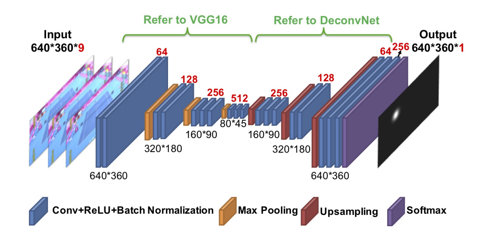

<div align="center">

# TrackNet

**A Deep Learning Network for Tracking High-speed and Tiny Objects in Sports Applications**

[Paper](https://arxiv.org/abs/1907.03698) • [Dataset](https://drive.google.com/file/d/1f74hu1F5Ipn8SshPkxK_1wO36f_DkqM-/view?usp=sharing) • [Pretrained Model](https://drive.google.com/file/d/1Rv2NpVwSoPpSq5HKSFyRASW0tUbLqamG/view?usp=sharing)

</div>

---

## 🎯 Overview

TrackNet is a deep learning architecture designed to track small, fast-moving objects (like tennis balls) in broadcast sports videos. The model processes **3 consecutive frames** to learn both object detection and trajectory patterns, outputting a Gaussian heatmap for precise ball localization.

### Model Architecture

<div align="center">
  
</div>

## 📦 Installation

```bash
# Clone repository
git clone https://github.com/Ky23r/TrackNet.git
cd TrackNet

# Install dependencies
pip install -r requirements.txt
```

## 📊 Dataset

📊 Dataset
The dataset contains 19,835 labeled frames from 10 broadcast videos

- **Resolution**: 1280×720
- **Format**: RGB images + CSV labels

**Download**: [Google Drive](https://drive.google.com/file/d/1f74hu1F5Ipn8SshPkxK_1wO36f_DkqM-/view?usp=sharing)

### Label Format

```csv
file name,visibility,x-coordinate,y-coordinate,status
0000.jpg,1,599.0,423.0,0.0
0001.jpg,1,601.0,406.0,0.0
...
```

## 🚀 Usage

### 1. Data Preparation

Run the preprocessing script to generate Gaussian heatmaps and split data:

```bash
python preprocess.py
```

This generates:
- Gaussian heatmap ground truths (`data/gts/`)
- Train/Val split CSVs (70/30)

**Expected structure**:
```
data/
├── images/
│   ├── game1/
│   │   ├── Clip1/
│   │   │   ├── 0000.jpg
│   │   │   ├── 0001.jpg
│   │   │   ├── ...
│   │   │   └── Label.csv
│   │   ├── Clip2/
│   │   │   └── ...
│   │   └── ...
│   ├── game2/
│   │   └── ...
│   └──
├── gts/
│   ├── game1/
│   │   ├── Clip1/
│   │   │   ├── 0000.jpg
│   │   │   ├── ...
│   │   └── ...
│   └── ...
├── train.csv
└── val.csv
```

### 2. Training

```bash
python train.py \
    --exp my_exp \
    --batch-size 8 \
    --epochs 200 \
    --lr 1.0 \
    --workers 4
```

**Arguments**:
| Argument | Default | Description |
|----------|---------|-------------|
| `--exp` | `default` | Experiment name |
| `--batch-size` | `4` | Batch size |
| `--epochs` | `200` | Training epochs |
| `--lr` | `1.0` | Learning rate (Adadelta) |
| `--steps` | `200` | Steps per epoch |
| `--val-interval` | `1` | Validation frequency |

**Outputs**:
- `exps/my_exp/best.pt` - Best model (highest F1)
- `exps/my_exp/last.pt` - Last checkpoint

### 3. Evaluation

```bash
python test.py --model exps/my_exp/best.pt
```

**Metrics**:
- Precision, Recall, F1 Score
- Detection threshold: 5 pixels

### 4. Inference on Video

```bash
python infer.py \
    --model exps/my_exp/best.pt \
    --input video.mp4 \
    --output result.mp4 \
    --interpolate
```

**Options**:
- `--interpolate`: Smooth trajectory with gap filling
- `--width/height`: Model input size (default: 640×360)

## 🤖 Pretrained Model

A pretrained model is available for quick testing without training from scratch.

**Download**: [Google Drive](https://drive.google.com/file/d/1Rv2NpVwSoPpSq5HKSFyRASW0tUbLqamG/view?usp=sharing)

## 🎬 Demo

<div align="center">
  
</div>

---

<div align="center">

**⭐ Star this repo if you find it useful!**

</div>


