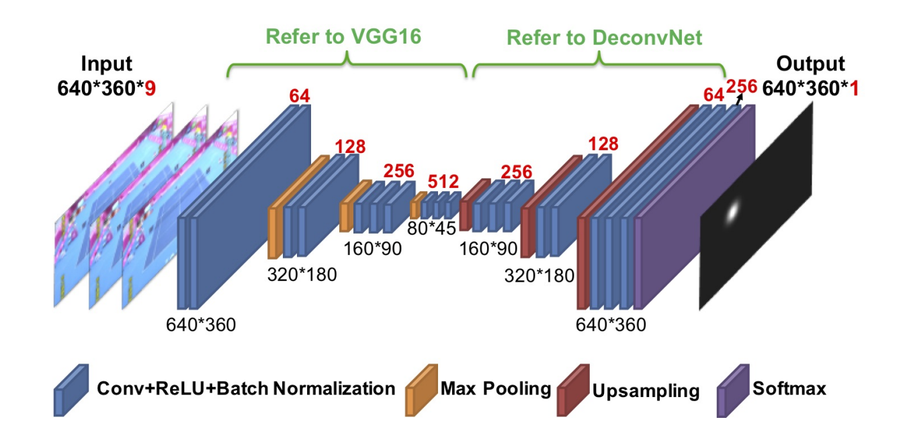
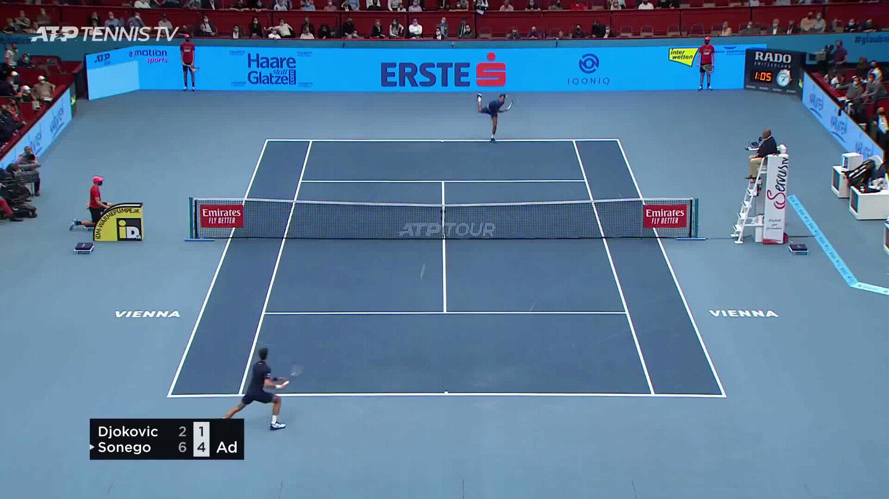

<div align="center">

# TrackNet

**Deep Learning for Tracking High-Speed, Tiny Objects in Sports Video**

[Paper](https://arxiv.org/abs/1907.03698) • [Dataset](https://drive.google.com/file/d/1f74hu1F5Ipn8SshPkxK_1wO36f_DkqM-/view?usp=sharing) • [Pretrained Model](https://drive.google.com/file/d/1Rv2NpVwSoPpSq5HKSFyRASW0tUbLqamG/view?usp=sharing)

</div>

---

## Overview

TrackNet is a deep learning architecture designed to track small, fast-moving objects — like tennis balls — in broadcast sports videos. Instead of processing a single frame, it takes **three consecutive frames** as input, allowing it to learn both appearance and motion simultaneously.

The model outputs a 2-D Gaussian heatmap: a bright spot centred at the predicted ball location, zero everywhere else. Ball coordinates are then extracted from the heatmap using Hough circle detection.

<div align="center">
  
</div>

### Model architecture

The network is a U-Net-style encoder–decoder:

- **Input**: 9 channels (3 consecutive RGB frames × 3 channels)
- **Encoder**: three pooling stages (64 → 128 → 256 → 512 channels)
- **Decoder**: three upsampling stages back to the input resolution
- **Output**: 256-class per-pixel classification; each class represents a heatmap intensity level (0–255)
- **Loss**: cross-entropy (the Gaussian intensity is the target class per pixel)

---

## Requirements

- Python **3.8** or newer
- PyTorch (CUDA strongly recommended for training; CPU works for inference)
- All other dependencies: `torch`, `numpy`, `pandas`, `opencv-python`, `scipy`, `tqdm`

Works on **Windows**, **Linux**, and **macOS** without modification.

---

## Installation

```bash
git clone https://github.com/Ky23r/TrackNet.git
cd TrackNet
pip install -r requirements.txt
```

---

## Quick Start with the Pretrained Model

1. Download `best.pt` from [Google Drive](https://drive.google.com/file/d/1Rv2NpVwSoPpSq5HKSFyRASW0tUbLqamG/view?usp=sharing) and save it to `pretrained/best.pt`.
2. Place a tennis match video in `input_videos/`.
3. Run inference:

```bash
python scripts/infer_video.py \
    --model pretrained/best.pt \
    --input input_videos/match.mp4 \
    --output output_videos/result.mp4 \
    --interpolate
```

The annotated video is written to `output_videos/result.mp4`.

---

## Training from Scratch

### Step 1 — Download the dataset

Download from [Google Drive](https://drive.google.com/file/d/1f74hu1F5Ipn8SshPkxK_1wO36f_DkqM-/view?usp=sharing) and extract to `data/`.

### Step 2 — Arrange the data

The expected directory layout after extraction:

```
data/
└── images/
    ├── game1/
    │   ├── Clip1/
    │   │   ├── 0000.jpg
    │   │   ├── 0001.jpg
    │   │   ├── ...
    │   │   └── Label.csv
    │   ├── Clip2/
    │   │   └── ...
    │   └── ...
    ├── game2/
    │   └── ...
    └── ...
```

Each `Label.csv` uses this format:

```
file name,visibility,x-coordinate,y-coordinate,status
0000.jpg,1,599.0,423.0,0.0
0001.jpg,0,,,0.0
```

Visibility codes:

| Code | Meaning |
|------|---------|
| `0` | Ball not visible |
| `1` | Ball visible |
| `2` | Ball visible but partially occluded |
| `3` | Ball visible but motion-blurred |

### Step 3 — Preprocess

Generate Gaussian heatmaps and create train/val splits:

```bash
python scripts/preprocess.py \
    --images-dir data/images \
    --output-heatmaps-dir data/gts
```

| Argument | Default | Description |
|----------|---------|-------------|
| `--images-dir` | `data/images` | Raw frames directory |
| `--output-heatmaps-dir` | `data/gts` | Where to write heatmap images |
| `--output-splits-dir` | `data` | Where to write `train.csv` / `val.csv` |
| `--train-ratio` | `0.7` | Fraction used for training |
| `--radius` | `20` | Gaussian radius (pixels) |
| `--variance` | `10` | Gaussian variance |
| `--width` | `1280` | Original image width |
| `--height` | `720` | Original image height |
| `--skip-heatmaps` | — | Skip if heatmaps already exist |
| `--skip-splits` | — | Skip if splits already exist |

**Output:**

```
data/
├── gts/          ← generated heatmaps (one per frame)
├── train.csv     ← training split
└── val.csv       ← validation split
```

### Step 4 — Train

```bash
python scripts/train.py --exp my_run --batch-size 8 --epochs 200
```

| Argument | Default | Description |
|----------|---------|-------------|
| `--exp` | `default` | Experiment name |
| `--data-root` | `data` | Root directory with `train.csv` / `val.csv` |
| `--batch-size` | `2` | Training batch size |
| `--epochs` | `200` | Total number of epochs to train |
| `--lr` | `1.0` | Learning rate (Adadelta) |
| `--steps` | `200` | Maximum steps per epoch |
| `--val-interval` | `5` | Validate every N epochs |
| `--workers` | `1` | DataLoader worker processes |
| `--device` | auto | `cuda`, `cpu`, or leave blank to auto-detect |
| `--resume` | — | Path to checkpoint to resume from |
| `--log-dir` | `logs` | Directory for log files |

**Output:**

```
exps/my_run/
├── best.pt   ← checkpoint with the highest validation F1 score
└── last.pt   ← most recent checkpoint (use this for --resume)

logs/
└── my_run_20240615_142030.log   ← full training log
```

### Step 5 — Evaluate

```bash
python scripts/test.py --model exps/my_run/best.pt
```

Add `--detailed` for a per-visibility-class breakdown.

| Argument | Default | Description |
|----------|---------|-------------|
| `--model` | *required* | Path to checkpoint |
| `--data-root` | `data` | Root directory with `val.csv` |
| `--batch-size` | `4` | Batch size |
| `--workers` | `1` | DataLoader workers |
| `--device` | auto | `cuda` or `cpu` |
| `--detailed` | — | Show per-class metrics |

**Reported metrics:** Precision, Recall, F1 Score (detection threshold = 5 px).

### Step 6 — Inference on video

```bash
python scripts/infer_video.py \
    --model exps/my_run/best.pt \
    --input input_videos/match.mp4 \
    --output output_videos/result.mp4 \
    --interpolate
```

| Argument | Default | Description |
|----------|---------|-------------|
| `--model` | *required* | Path to checkpoint |
| `--input` | *required* | Input video file |
| `--output` | *required* | Output video file |
| `--interpolate` | — | Fill short trajectory gaps with linear interpolation |
| `--trace-length` | `7` | Frames of trajectory trail to draw |
| `--width` | `640` | Model input width |
| `--height` | `360` | Model input height |
| `--device` | auto | `cuda` or `cpu` |

---

## Resuming an Interrupted Training Run

If training is interrupted for any reason (Ctrl+C, crash, out-of-memory), resume from the last saved checkpoint:

```bash
python scripts/train.py \
    --exp my_run \
    --epochs 200 \
    --resume exps/my_run/last.pt
```

The run resumes from where it left off, restoring:
- Model weights
- Optimizer state (Adadelta accumulators)
- Epoch count
- Best F1 score achieved so far

To train for additional epochs beyond the original target, increase `--epochs`:

```bash
python scripts/train.py --exp my_run --epochs 300 --resume exps/my_run/last.pt
```

---

## Training Logs

Every training run creates a timestamped log file in `logs/`:

```
logs/my_run_20240615_142030.log
```

The log records:
- Full training configuration
- Per-epoch training loss
- Validation metrics (loss, precision, recall, F1) at each validation step
- Best checkpoint saves with the F1 score at the time

```
2024-06-15 14:20:30 | INFO     | Experiment  : my_run
2024-06-15 14:20:30 | INFO     | Device      : cuda
2024-06-15 14:20:30 | INFO     | Batch size  : 8
...
2024-06-15 14:25:11 | INFO     | Epoch 5/200 | val_loss=0.1234 | P=0.82 R=0.78 F1=0.80
2024-06-15 14:25:11 | INFO     | New best F1=0.8000 → saved best.pt
```

---

## Repository Structure

```
TrackNet/
├── assets/                  # Demo GIF and architecture diagram
├── data/                    # Dataset (not version-controlled)
│   ├── images/              # Raw frames (game1–game10)
│   ├── gts/                 # Generated heatmaps
│   ├── train.csv            # Training split
│   └── val.csv              # Validation split
├── exps/                    # Experiment checkpoints (not version-controlled)
│   └── <exp_name>/
│       ├── best.pt
│       └── last.pt
├── logs/                    # Training logs (not version-controlled)
├── pretrained/              # Downloaded pretrained weights (not version-controlled)
├── input_videos/            # Input videos for inference
├── output_videos/           # Annotated output videos
├── scripts/                 # Entry-point scripts
│   ├── preprocess.py        # Generate heatmaps + splits
│   ├── train.py             # Train the model
│   ├── test.py              # Evaluate on validation set
│   └── infer_video.py       # Run inference on a video
├── src/                     # Source package
│   ├── config.py            # All configuration constants
│   ├── datasets/            # PyTorch Dataset and DataLoader
│   ├── inference/           # Video inference pipeline
│   ├── models/              # TrackNet model definition
│   ├── preprocessing/       # Heatmap generator and data splitter
│   ├── training/            # Trainer, TrainingManager, Evaluator
│   └── utils/               # Metrics, visualization, logger
├── requirements.txt
└── README.md
```

---

## Pretrained Model

A pretrained model trained on the full dataset is available:

**Download:** [Google Drive](https://drive.google.com/file/d/1Rv2NpVwSoPpSq5HKSFyRASW0tUbLqamG/view?usp=sharing)

Place the downloaded file at `pretrained/best.pt` and use it directly with `scripts/infer_video.py`.

---

## Demo

<div align="center">
  
</div>

---

<div align="center">

**Star the repo if you find it useful!**

</div>
